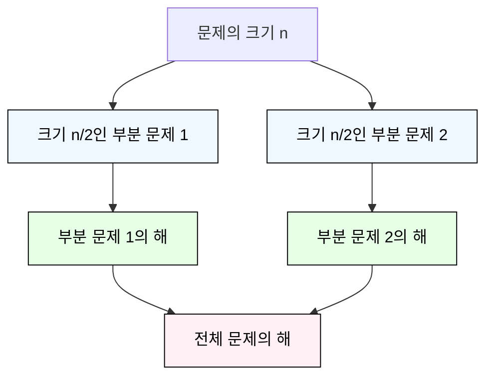

# 분할 정복
## 분할 정복 기법 
### 분할 정복의 개념
- 문제를 작은 하위 문제로 나누고(분할) 각각을 해결(정복)한 뒤, 그 결과를 결합(통합)하여 원래 문제를 해결하는 알고리즘 기법

### 분할 정복 기법의 유래
- 1805년 12월 2일 아우스터리츠 전투에서 나폴레옹이 사용한 전략
- 전력이 우세한 연합군을 공격하기 위해 나폴레옹은 연합군의 중앙부로 쳐들어가 연합군을 둘로 나눔
- 둘로 나뉜 연합군을 한 부분씩 격파함

### 분할 정복 기법의 설계 전략
- 분할(Divide) : 해결할 문제를 여러 개의 작은 부분으로 나눔
- 정복(Conquer) : 나눈 작은 문제를 각각 해결
- 통합(Combine) : (필요하다면) 해결된 해답을 모음

### 분할 정복 기법의 구조
- Top-down approach 예시 

---

## 병합 정렬(Merge Sort)
- 여러 개의 정렬된 자료의 집합을 병합하여 한 개의 정렬된 집합으로 만드는 방식

### 병합 정렬 과정
- 자료를 최소 단위의 문제까지 나눈 후에 차례대로 정렬하여 최종 결과를 얻어냄
- top-down 방식

### 시간 복잡도
- O(n log n)

---

## 퀵 정렬(Quick Sort)
- 기준값을 중심으로 주어진 배열을 두 개로 분할하고, 각각을 정렬하여 전체 배열을 정렬하는 방식 

### 병합 정렬과 퀵 정렬의 차이 
| 구분     | 병합 정렬                           | 퀵 정렬                                                                 |
|----------|------------------------------------|------------------------------------------------------------------------|
| 분할 기준 | 단순히 배열을 반으로 나눔            | 기준 아이템(pivot item)을 중심으로 기준보다 작은 것은 왼편, 큰 것을 오른편에 위치 시킴 |
| 병합 처리 | 정렬된 부분을 다시 병합하는 과정이 필요 | 별도의 병합 과정 불필요                                                   |

### 시간 복잡도
- 평균 시간 복잡도 O(nlogn)
- Partitioning이라는 과정을 반복하면서, 빠른 속도로 정렬이 되는 알고리즘

### Partitioning
1. **작업 영역을 정한다**
2. 작엽 영역 중 가장 왼쪽에 있는 수를 Pivot이라고 하자.(Pivot을 '기준'으로 해석함)
3. Pivot을 기준으로 
  - 왼쪽에는 Pivot 보다 작은 수를 배치함(정렬 안됨)
  - 오른족에는 Pivot보다 큰 수를 배치함(정렬 안됨)

- 파티셔닝이 끝나고 Pivot의 위치는 확정(Fix)됨
- 즉, 정렬이 다 되었을 때에도 Pivot의 위치는 지금 위치 그대로 배정됨
* 한 번의 파티셔닝 이후, 왼쪽과 오른쪽 부분 배열에 대해 재귀적으로 파티셔닝을 반복하여 정렬

* Hoare-Partition / Lomuto Partition

---

## 이진 검색(Binary Search)
- 자료의 가운데에 있는 항목의 키 값과 비교하여 다음 검색의 위치를 결정하고 검색을 계속 진행하는 방법
- 목적 키를 찾을 때까지 이진 검색을 순환적으로 반복 수행함으로써 검색 범위를 반으로 줄여가면서 보다 빠르게 검색을 수행함

### 이진 검색의 과정
1. 자료의 중앙에 있는 원소를 고름
2. 중앙 원소의 값과 찾고자 하는 목표 값을 비교
3. 목표 값이 중앙 원소의 값보다 작으면 자료의 왼쪽 반에 대해서 새로 검색을 수행하고 크다면 자료의 오른쪽 반에 대해서 새로 검색을 수행
- 찾고자 하는 값을 찾을 때까지 1 ~ 3 과정을 반복 

* 이진 검색을 하기 위해서는 자료가 정렬된 상태여야 함

---

## 분할 정복 알고리즘 정리
1. 병합 정렬
  - 외부 정렬(External Sort)의 기본이 되는 정렬 알고리즘
  - 멀티코어(Multi-Core) CPU나 다수의 프로세서에서 정렬 알고리즘을 병렬화하기 위해 병합 정렬 알고리즘이 활용됨

2. 퀵 정렬
  - 매우 큰 입력 데이터에 대해서 좋은 성능을 보이는 알고리즘

3. 이진 검색 
  - 정렬된 데이터를 기준으로 특정 값이나 범위를 검색하는 데 사용
  - [이진 검색을 활용한 심화 학습 키워드] Lower Bound, Upper Bound
    - 정렬된 배열에서 특정 값 이상(이하)가 처음으로 나타나는 위치를 찾는 알고리즘
    - 특정 데이터의 범위 검색 등에서 활용

  