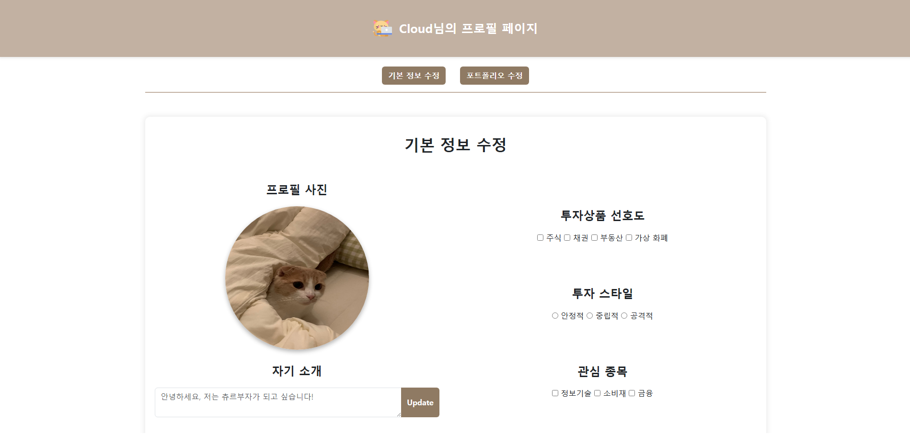
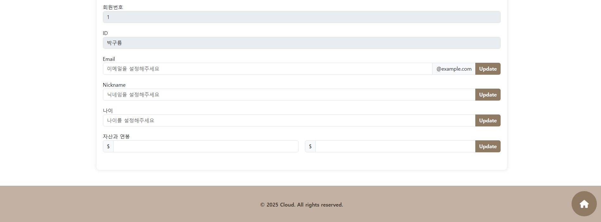
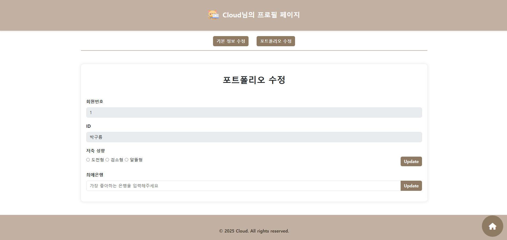
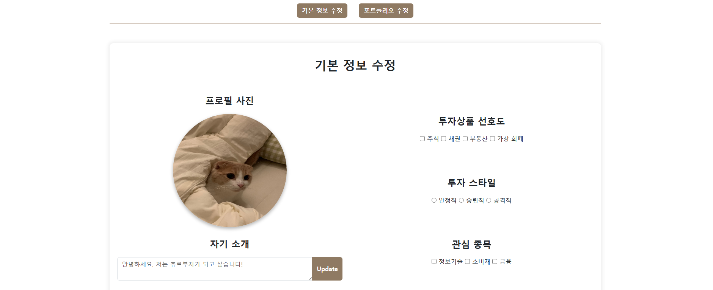
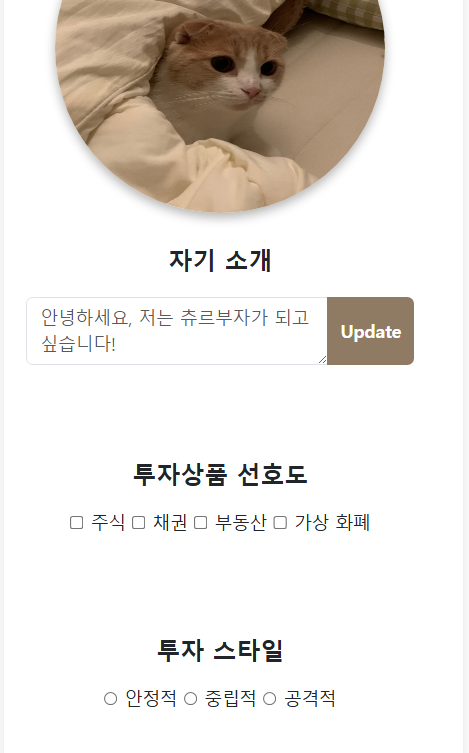

# 03-pjt - 반응형  Profile  페이지  구현

---

## 구현 기능

### 1. 기본 정보 수정 페이지 (`profile.html`)

* **프로필 사진**: 원형 + 그림자 효과 적용
* **자기소개 입력**: `textarea`와 `button`을 활용해 업데이트 가능
* **투자 성향 입력**
  * 투자상품 선호도 (checkbox)
  * 투자 스타일 (radio button)
  * 관심 종목 (checkbox)
* **회원 정보 입력**
  * 회원번호, ID → 수정 불가 필드
  * Email, Nickname, 나이, 자산/연봉 → 수정 가능 필드 (`input-group` + `button` 조합)

---

### 2. 포트폴리오 수정 페이지 (`portfolio.html`)

* **회원번호, ID** → 읽기 전용 필드
* **저축 성향** → `radio button`으로 선택 가능
* **최애 은행 입력** → `input` + `Update` 버튼 조합

---

### 3. 네비게이션 바

* 상단에 **탭 버튼** 형태로 구현
* `기본 정보 수정 ↔ 포트폴리오 수정` 페이지 간 이동 가능

---

### 4. 반응형 디자인

  

* **Bootstrap Grid System** (`col-12 col-md-6`) 활용
* 화면 크기에 따라 배치 변화:
  * **768px 이상** → 프로필 사진과 투자 성향이 좌우 배치
  * **768px 미만** → 투자 성향이 자기소개 밑으로 내려옴

---

### 5. 공통 디자인 요소

  

* **Header / Footer**: 따뜻한 베이지 톤 배경과 텍스트 강조
* **Home 버튼**: `postion-fixed`를 통하여 사용자의 `scroll`에 따라 움직이도록 함 -> 클릭하면 홈으로 돌아갈 수 있도록 하기 위한 목적 (`font-awesome` 아이콘 사용)
* **전체 스타일링**: `index.css`로 일관된 레이아웃, 버튼 색상(#8f7a63), 그림자 효과 적용

---

## 느낀 점

* 단순히 HTML과 CSS로 페이지를 만드는 것을 넘어서 실제 서비스에 어울리는 프로필/포트폴리오 페이지에 대해 생각해보는 계기가 되었다.
* Bootstrap의 편리함을 느낄 수 있었고 앞으로 더 활용해야겠다고 생각이 들었다. 
* 반응형 레이아웃을 고려하면서 화면 크기에 따라 UI가 자연스럽게 변하도록 설계하는 감각을 익힐 수 있었다.
* 금융 애플리케이션과 같은 실제 서비스에 맞는 디자인을 구현하면서 앞으로 더 다양한 UI/UX 설계 역량을 쌓아야겠다고 느꼈다.
